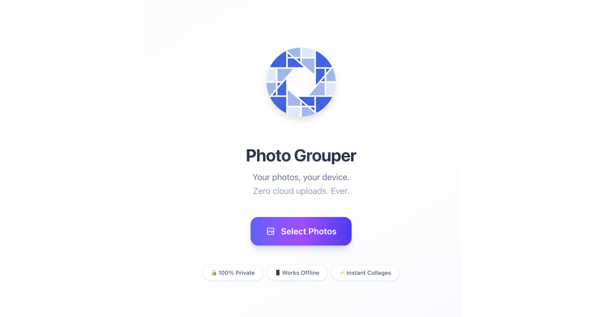

# Photo Grouper

> A privacy-first, offline-capable photo collage maker. Your photos never leave your device.



Photo Grouper is a [Next.js](https://nextjs.org) PWA for turning 2–9 photos into a clean, shareable collage — entirely in your browser. There is no account, no upload, and no server-side processing. Every pixel is loaded, edited, and exported locally.

## ▶️ Try it free

**[photogrouper.com](https://photogrouper.com)** runs this exact app right in your browser — free, no account, no install, nothing to download.

> **Verifiable privacy:** everything runs client-side, so your photos never leave your device *even on the hosted site*. You don't have to take our word for it — this repository **is** the code that runs there, and you can read every line.

## Why Photo Grouper?

- **🔒 Privacy-first** — photos are read and processed in-browser and never uploaded anywhere.
- **🔍 Open & auditable** — MIT-licensed and fully open source, so the privacy claim above is verifiable, not just marketing copy.
- **📴 Offline-capable** — installable PWA with a service worker; works without a connection.
- **⚡ No account, no friction** — open it and start; nothing to sign up for.
- **🪶 Lightweight** — no image backend, no storage, no AI inference. Just a static client-side app.

## Features

- **Layouts** — many templates for 2 through 9 photos, in `clean`, `polaroid`, `rounded`, and `artistic` styles.
- **Per-photo editing** — pan, zoom, and rotate each slot; adjust brightness, contrast, saturation, and blur.
- **Touch gestures** — drag to pan, pinch to zoom, long-press to arm a photo swap.
- **Instagram-style filters** — Mono, Noir, Sepia, Vintage, Fade, Warm, Cool, Vivid, and more, with live previews and "apply to all".
- **Output aspect ratios** — export for Instagram (1:1, 4:5), Stories/Reels (9:16), YouTube/X (16:9), Pinterest (2:3), and more.
- **Style controls** — background color, photo gap, corner radius, and outer padding.
- **Canvas export** — high-resolution JPEG output that matches the editor preview, via the native share sheet or download.

## Tech Stack

| Layer | Technology |
|-------|------------|
| Framework | Next.js 16 (App Router) |
| UI | React 19 |
| Language | TypeScript |
| Styling | Tailwind CSS v4 |
| Icons | Lucide React |
| Image compression | browser-image-compression |
| PWA | next-pwa |

## Getting Started (self-hosting & development)

> Just want to make a collage? Use the free hosted app at **[photogrouper.com](https://photogrouper.com)** — no setup required. The steps below are only for running or modifying the project yourself.

Requires **Node.js 20+**.

```bash
# Clone
git clone https://github.com/namabeeru/photo-grouper.git
cd photo-grouper

# Install dependencies
npm install

# Start the dev server
npm run dev
```

Open [http://localhost:3000](http://localhost:3000) in your browser.

### Other commands

```bash
npm run build   # Production build
npm run start   # Serve the production build
npm run lint    # Run ESLint
```

## How It Works

Photo Grouper is a three-phase client-side state machine — **Home → Selection → Editor** — with all state held in React (`app/page.tsx`). Selected images are compressed with `browser-image-compression`, arranged into a chosen template, edited per slot, and finally rendered to a `<canvas>` for export. Nothing is ever sent to a server.

For a deeper dive into the architecture, components, and rendering pipeline, see [ARCHITECTURE.md](ARCHITECTURE.md).

## Deployment

The official hosted instance is **[photogrouper.com](https://photogrouper.com)**.

This is a standard Next.js app and also deploys cleanly to any platform that supports Next.js (Vercel, Netlify, Cloudflare, a Node host, etc.). Because all processing is client-side, no environment variables or backend services are required to run it.

## Contributing

Contributions are welcome! New collage templates, filters, bug fixes, and accessibility improvements are all great places to start. See [CONTRIBUTING.md](CONTRIBUTING.md) for setup and guidelines.

## License

[MIT](LICENSE) © namabeeru
